# My Game Projects

## University Projects

This section describes the games I developed during my informatics studies at the Technical University of Munich (TUM). They are presented in the order I worked on them.

### Pic2Program

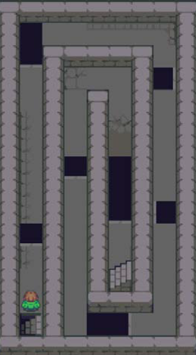

In my bachelor's degree, I participated in the practical course “IT-based learning,” where I developed the Serious Game “Pic2Program” with three fellow students within one semester. The game is an Android app that teaches children the basics of computational thinking. Players must find their way through increasingly complex mazes by writing short programs using an intuitive symbol language. The programs are input by taking photos of the symbols.

My tasks in the development of “Pic2Program” were:

* Development of the symbol language
* Implementation of the parser that validated the programs users wrote based on the input tokens generated from image recognition.
* Implementation of parts of the player movement logic
* Parts of the game design
* Testing and bug fixing
* Regularly fixing merge conflicts in git, whenever a teammate failed to push his/her changes for multiple days

The project helped me learn how to work with a team (general communication, git) and how to adapt my skills to new areas/technologies (Android Studio, libGDX).

The development and evaluation of “Pic2Program” was discussed by our course supervisors in a paper published in the 2020 IEEE Global Engineering Education Conference (EDUCON) and is available [here](https://ieeexplore.ieee.org/document/9125087) (subscription required).
A short trailer I cut for internal use can be found [here](https://youtu.be/16qAvqvi_5Q) (when watching, please keep in mind that this is the first video I ever edited).

Used technology: Android Studio, Java, libGDX

### QUAD

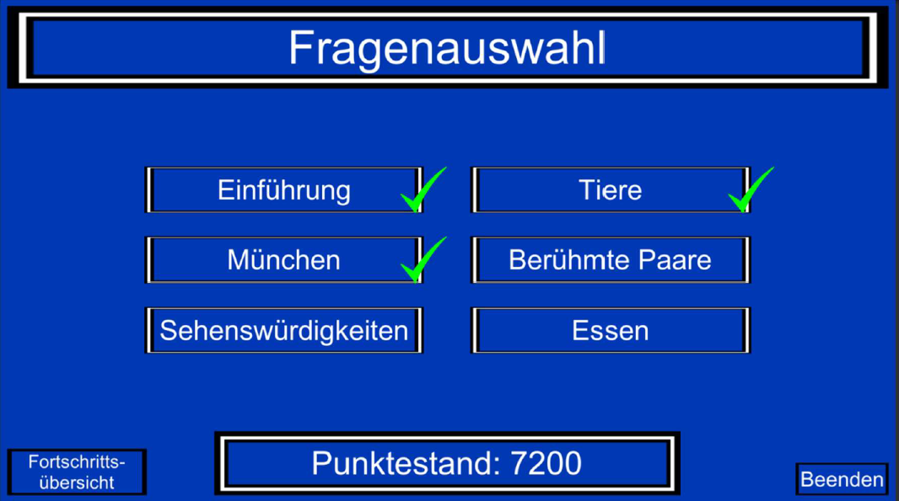
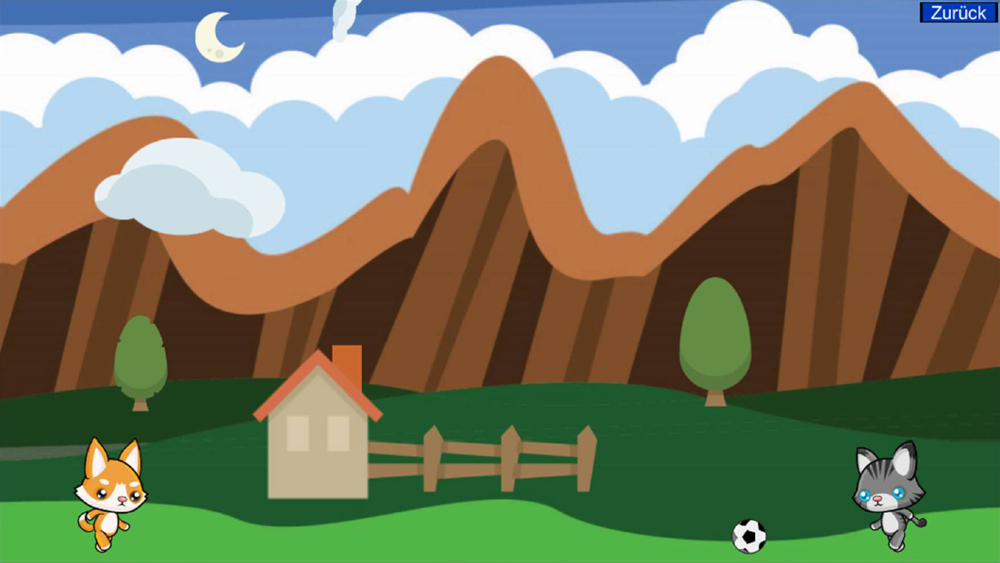

In my Bachelor’s Thesis, I developed a quiz game for Android-based mobile devices called “QUAD”. It is a Serious Game specifically designed for older adults with Dementia. “QUAD” is designed as a group activity where a game master (e.g., a nursing home caregiver) presents different questions to the audience. Multiple devices can connect to the game master to answer the question based on four possible answers. The game’s concept and design are oriented on popular German TV quiz shows like “Wer wird Millionär?”. Using questions focusing on topics popular among nursing home residents, the goal of “QUAD” is to let Dementia patients reminisce and talk about their past experiences to smaller their loneliness, a frequent consequence of Dementia.

The multiplayer component was implemented using [Ubi-Interact](https://github.com/SandroWeber/ubi-interact), a NodeJS-based plugin for Unity developed by [Sandro Weber](https://github.com/SandroWeber) at TUM. I also participated in fixing some bugs in the plugin I encountered during my development. The remaining game was developed exclusively by me within four months.

Developing "QUAD" taught me how to conceptualize a whole game on my own, develop it in a given time frame, and work with plugins offering only limited documentation.

The development and theoretical background of “QUAD” can be found in my Bachelor’s Thesis “Development of a Quiz-App for Mobile Devices to use with Dementia Patients”. Further, [this video](https://youtu.be/ph4A03Z5iBM) demonstrated how to use “QUAD”.

Used technology: Unity, C#, Ubi-Interact (NodeJS-based multiplayer plugin for Unity, developed at TUM), DaVinci Resolve

### Color Jump 3D

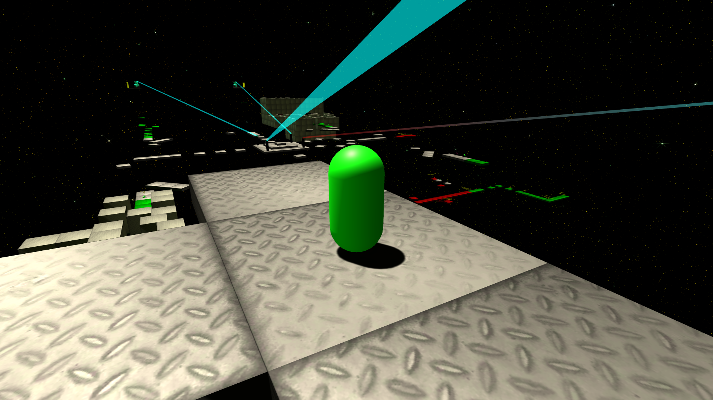

“Color Jump 3D” is a 3D puzzle platformer I developed solo for the “Introduction to Informatics for Games Engineering” lecture within one day. The player must solve four jump-and-run challenges while finding the right color to solve those riddles.

This was the first game I developed "game jam-like", i.e., in a very limited time to a given topic (a basic jump-and-run template was available from the lecture exercise). 

You can find demo videos in [this playlist](https://youtube.com/playlist?list=PLx037SnxNn8nyD2VVBRrMAa-_YPoUhja-&si=zYDj_mj23EPdhrHY) or download the game from [itch.io](https://mauri2070.itch.io/color-jump-3d).

Used technology: Unity, C#, DaVinci Resolve

### Blub’s Adventure

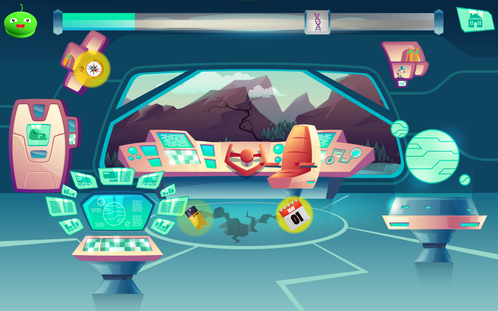
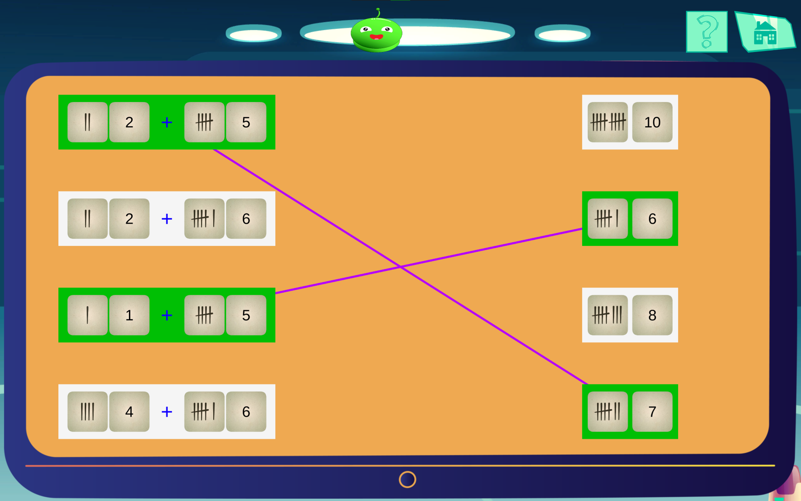

“Blub’s Adventure” (German name: Blubs Abenteuer) is a serious game for preschool children available for Android and Windows. It aims to teach them the connection between number values and their Arabic representation, and basic calculations using addition and subtraction. I developed the game with [Maximilian Anzinger](https://github.com/MaximilianAnzinger) for the interdisciplinary project with educational psychology we had to do for our Master’s degree. The development was supervised by the [research team of Prof. Dr. Frank Niklas](https://www.psy.lmu.de/ffp_en/persons/ag-niklas/index.html), professor for Educational Psychology and Family Studies at the University of Munich (LMU). This team further acted as our clients, providing feedback and new feature requests iteratively. The project started with a seminar/lecture phase of one semester, during which we implemented a prototype. The development of the final game and the completion of the report took another year of irregular feedback loops.

My tasks in the development of “Blub’s Adventure” were:

* All gameplay and UI programming
* Implementation of cutscene videos into Unity
* Design and implementation of additional help systems
* Parts of the game design
* Parts of the level design

During the development of "Blub's Adventure" I learned how to properly communicate my vision for a game, plan and realize a more complex project, and how to work with a "customer".

A description of the development and theoretical background of “Blub’s Adventure” can be found in the project report “Blub’s Adventure – an Educational Android Application Teaching Numeracy”. A complete gameplay walkthrough can be found in [this playlist](https://www.youtube.com/playlist?list=PLx037SnxNn8neuPhdR_PWuka9DNtJm4iR). Further, the project files and game build can be found on [GitHub](https://github.com/Mauri2070/Blubs-Abenteuer) or you can download the game from [itch.io](https://mauri2070.itch.io/blubs-abenteuer).

Used technology: Unity, C#, DaVinci Resolve

### Robody at the Hospital

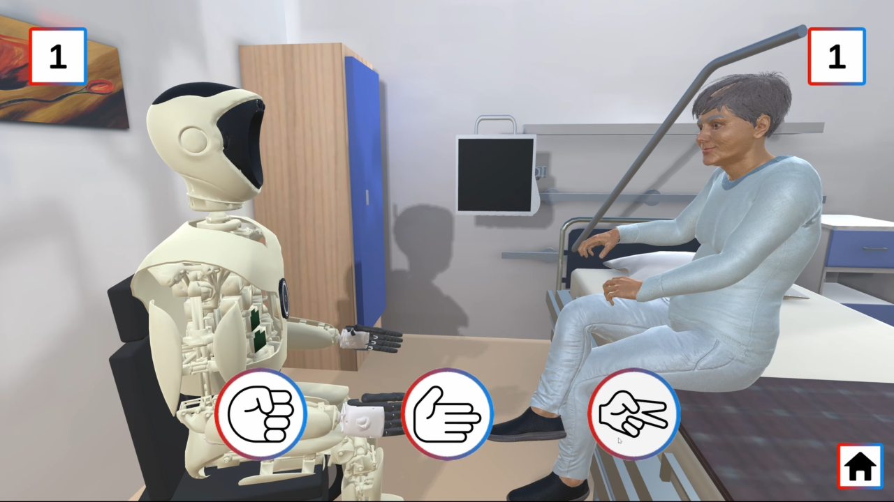

Robody is a care robot developed by [Devanthro](https://www.devanthro.com/) with the goal to support nurses with their tasks and allow relatives to remotely visit patients if visits in person are impossible. Part of my 6 month long Master’s Thesis “Improving Hospital Care by Developing Serious Games” was to improve the acceptance of Robody (about 1/3 of the total work), because this is often an issue with care robots. “Robody im Krankenhaus” (Engl. Robody at the hospital, short RiK) is a story-focused serious game introducing the robot to hospital patients, relatives, and nurses.

With the development of RiK I learned how to implement cinematic cutscenes within Unity using the Timeline, Cinemachine, and Animation & Rigging packages.

The game can be found on [GitHub](https://github.com/Mauri2070/Master-s-Thesis-Improving-Hospital-Care-by-Developing-Serious-Games) (German only!) and [this playlist](https://youtube.com/playlist?list=PLx037SnxNn8kCbP_UTHicramWIrKc6Bpw&si=vStL8Y4KXfBm85TS) contains videos of the game. If you are interested in the full-text of my thesis, please contact me directly: [georgm.henning@gmx.de](mailto:georgm.henning@gmx.de)

Used technology: Unity, C#, Blender, Inkscape, Audacity, DaVinci Resolve

### Bonus program for Nurses

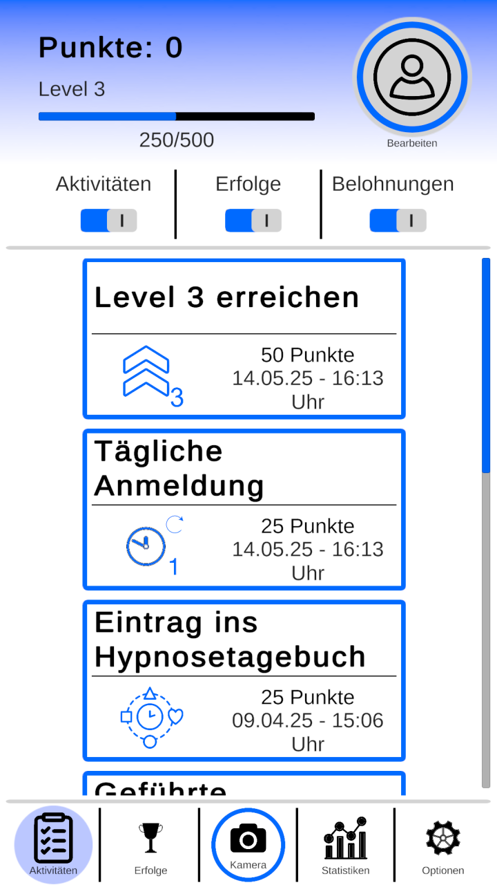
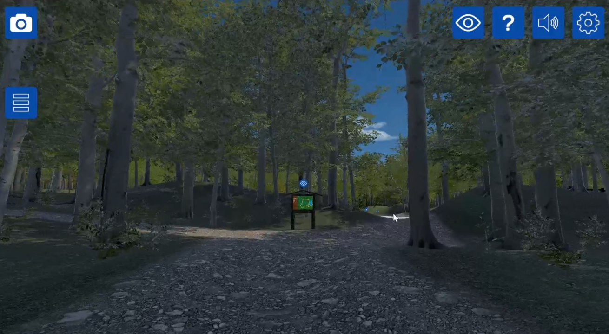

Stress is one of the most common problems of nurses, and (self-)hypnosis may be a potential solution to better cope with it. As part of my 6 month long Master’s Thesis “Improving Hospital Care by Developing Serious Games,” I developed a bonus program for nurses (short BfP) consisting of multiple apps (about 1/3 of the total work). A central app allows users to collect points with activities in other apps or the real world, and spend them for in-app or real-world rewards to increase motivation for healthy behavior. An example app for the program teaches its users self-hypnosis. Finally, the third app generates compatible QR codes used for real-world app interactions.

For these apps I learned how to generate and read QR codes, and about access permissions on Android. Additionally, I learned and applied different optimization methods available in Unity to achieve a stable, playable framerate even on older low-end Android devices.

The apps can be found on [GitHub](https://github.com/Mauri2070/Master-s-Thesis-Improving-Hospital-Care-by-Developing-Serious-Games) (German only!) and [this playlist](https://youtube.com/playlist?list=PLx037SnxNn8kCbP_UTHicramWIrKc6Bpw&si=vStL8Y4KXfBm85TS) contains videos of the apps. If you are interested in the full-text of my thesis, please contact me directly: [georgm.henning@gmx.de](mailto:georgm.henning@gmx.de)

Additionally, a standalone version of the self-hypnosis app can be found on the [website of my father](https://drtjhenning.de/selbsthypnose-app/), who supported the development with his expert knowledge about hypnosis and recorded the hypnosis instructions featured in the app.

Used technology: Unity, C#, Blender, Inkscape, Audacity, DaVinci Resolve

### ArthroTour

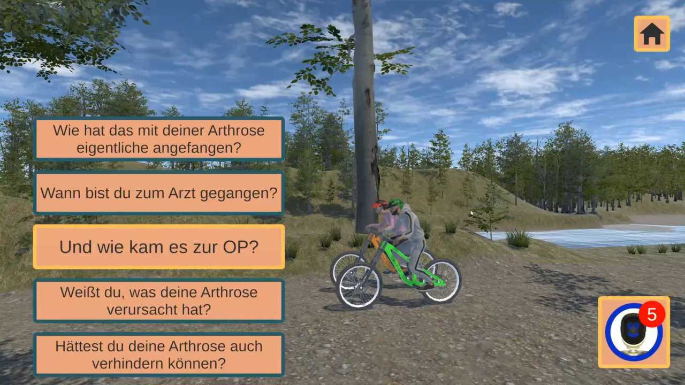

Osteoarthritis is the economically most important disease of the musculoskeletal system, and there is no known cure for it. This makes prevention especially important. As part of my 6 month long Master’s Thesis “Improving Hospital Care by Developing Serious Games,” I developed the serious game “ArthroTour” that educates the players about osteoarthritis (about 1/3 of the total work). Information is provided during a short story, before it is repeated in a quiz.

For this game, I learned about procedural animations using Unity's Animation & Rigging package and how to make a 3D environment look larger by using the parallax effect.

The game can be found on [GitHub](https://github.com/Mauri2070/Master-s-Thesis-Improving-Hospital-Care-by-Developing-Serious-Games) (German only!) and [this playlist](https://youtube.com/playlist?list=PLx037SnxNn8kCbP_UTHicramWIrKc6Bpw&si=vStL8Y4KXfBm85TS) contains a video of the game. If you are interested in the full-text of my thesis, please contact me directly: [georgm.henning@gmx.de](mailto:georgm.henning@gmx.de)

Used technology: Unity, C#, Blender, Inkscape, Audacity, DaVinci Resolve

## How I learned game development with Unity: GameDev.tv course projects

This section describes the game projects I completed to learn the basics of game development with Unity, following online courses from [GameDev.tv](https://www.gamedev.tv/). For some projects, I just followed along; for others, I added additional features and levels on my own. The games are presented in arbitrary order.

### Jackys Abenteuer (Text101)

I started learning Unity using the “Complete C# Unity 2D Game Developer” course by GameDev.tv. Part of this course was the “Text101” text adventure game, where you can choose what happens next in the story. “Jackys Abenteuer” (engl. Jacky’s Adventure) is my version of this game featuring my own, Halloween-themed story. 

You can download the game from [itch.io](https://mauri2070.itch.io/jackys-abenteuer) (German only!).

Used technologies: Unity, C#

### Glitch Garden

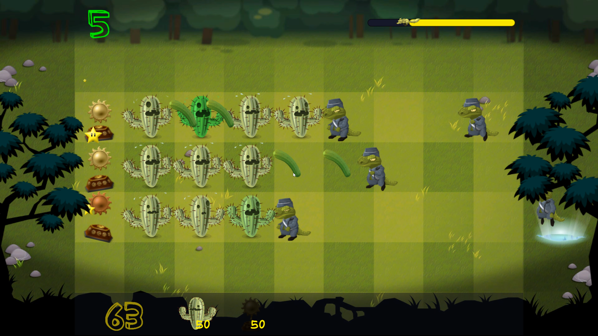

I started learning Unity using the “Complete C# Unity 2D Game Developer” course by GameDev.tv. Part of this course was “Glitch Garden”, a “Plants vs. Zombies”-like tower defense game. The game features different levels with increasing difficulty and available “towers”. 

You can get an idea of the game in [this video](https://youtu.be/sqAD9AIDnsM).

Used technologies: Unity, C#

### Laser Defender

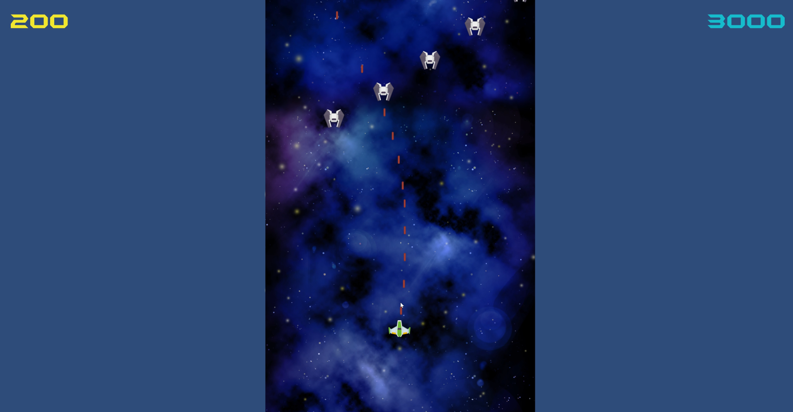

I started learning Unity using the “Complete C# Unity 2D Game Developer” course by GameDev.tv. Part of this course was “Laser Defender”, a bullet-hell shooter inspired by the classic “Space Invaders” game. Enemies appear in predefined waves that loop until the player loses their final life. 

You can get an idea of the game in [this video](https://youtu.be/W02YLL82mfQ).

Used technologies: Unity, C#

### Block Breaker

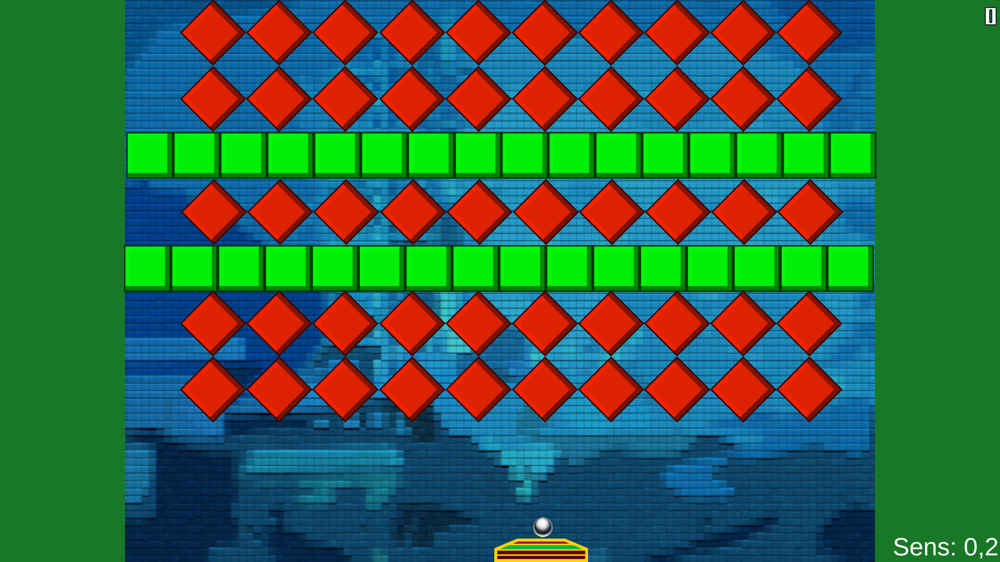

I started learning Unity using the “Complete C# Unity 2D Game Developer” course by GameDev.tv. “Block Breaker” was part of this course. The goal of this game is to destroy blocks by guiding a bouncing ball with a paddle. “Block Breaker” features multiple levels with different block layouts. In my version, I added keyboard controls with adaptable sensitivity to the initial mouse-only input, an autoplay option, and a level selection. 

You can download my version from [itch.io](https://mauri2070.itch.io/block-breaker) (German only!). It features additional levels and input options.

Used technologies: Unity, C#

## How I learned game development with Unreal: GameDev.tv course projects

This section describes the game projects I completed to learn the basics of Unreal, following online courses from [GameDev.tv](https://www.gamedev.tv/).

### UE5 C++ Developer Course

I used this online course to learn the basics of the Unreal Engine, including Actors, Pawns, Blueprints, etc.

The course contained five games: Warehouse Wreckage, a Blueprints-only game, where you throw a ball at barrels in the scene to knock them over. Obstacle Assault, a simple 3D platformer. Crypt Raider, a 3D puzzle adventure game. Toon Tanks, a third-person shooter with tanks and simple enemy turret AI. Simple Shooter, another third-person shooter with more advanced enemy AI behavior. 

You can find a compilation of the games in [this video](https://youtu.be/wJVMuZiYd08).

Used technologies: Unreal, C++

## Private Game Projects

This section describes the private game projects I developed solo for fun for my family and friends. They are presented in arbitrary order.

### PongPong

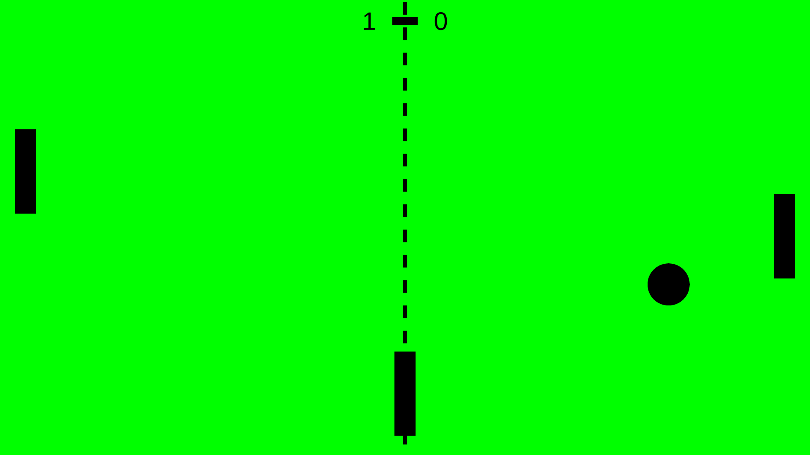

“PongPong” is a modern clone of the original Pong game for PC. It features gameplay against the AI in four different difficulty levels and local multiplayer. Further, different ball and paddle shapes and colors can be chosen. Additionally, three special modes can be activated: In “Where’s the ball?”, the side of the play area with the ball is hidden, so players have to anticipate where the ball will move. “Slow mode” will slow down the gameplay, and “Additional blocker” will add an automatically moving paddle in the middle of the play area. Finally, the game lets the player import their own music to be played as background music. 

I completed this game in 1-2 days and learned how to load assets at runtime.

You can download the game from [itch.io](https://mauri2070.itch.io/pongpong) (German only!).

Used technology: Unity, C#

### JumpJump

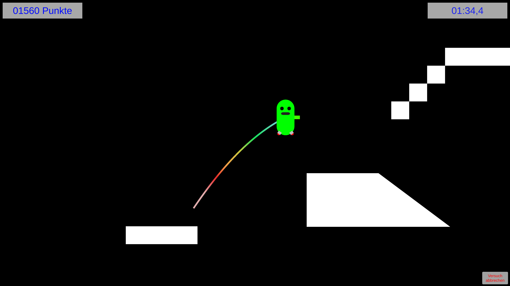

“JumpJump” is a small 2D platformer game for PC. The twist of the game is the controls. The player can only decide on one direction – left, right, or up – and determine the jump strength by holding down a button. The goal is to navigate through the level and collect as many points as possible, either in a limited time (60 or 120 seconds) or by reaching the goal as fast as possible. Scores are saved in a local leaderboard per category.

I completed this game in 1-2 days and learned how to separate the environment from game logic to support different game modes.

You can download the game from [itch.io](https://mauri2070.itch.io/jumpjump) (German only!).

Used technology: Unity, C#

### Decorate the Christmas Tree

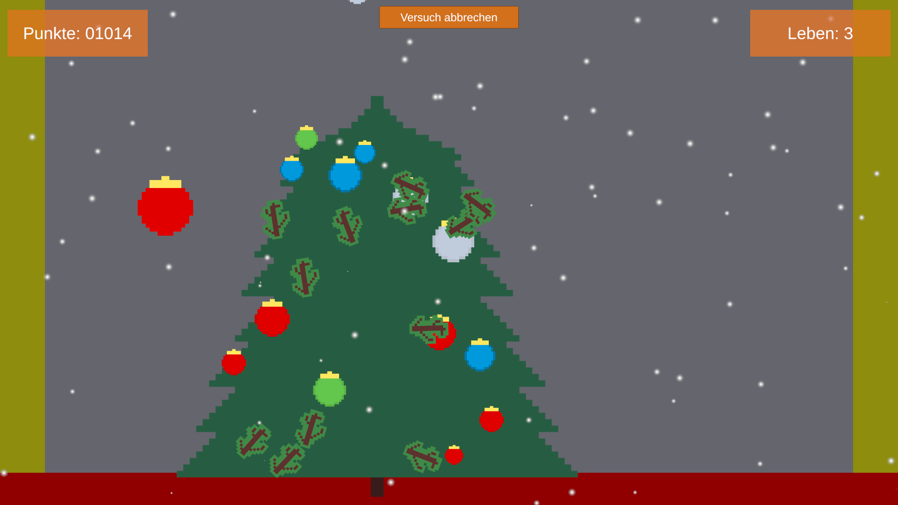

“Decorate the Christmas Tree” is a 2D game for PC and Android where the player must move a Christmas tree left and right to collect falling baubles. The game ends when too many baubles hit the ground. The difficulty increases over time when baubles start to spawn and fall faster. 

I developed the game on my own in one day, including the pixel art. With this game, I experimented with building the same game for different platforms (Android and Windows).

You can download the game from [itch.io](https://mauri2070.itch.io/schmueck-den-weihnachtsbaum) (German only!).

Used technology: Unity, C#, Pixel Studio

### Welder Run

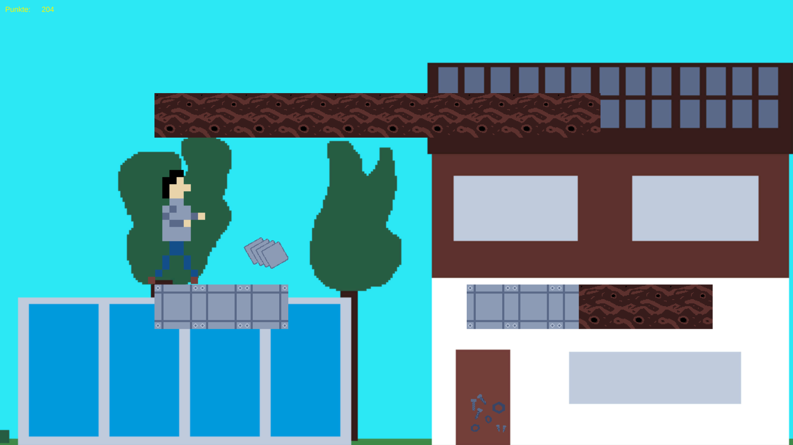

“Schweißer Lauf” (Engl. Welder Run) is a 2D side-scrolling endless runner for PC. The goal is to collect welding tools to gather points while avoiding obstacles. 

I made the pixel art and developed the game within one day. For this game, I experimented with 2D physics and endless scrolling textures.

You can download the game from [itch.io](https://mauri2070.itch.io/schweisser-lauf) (German only, but language is not important for this game).

Used technology: Unity, C#, Pixel Studio

## Game Jam Projects

This section describes the game projects I developed for Game Jams.

### Inventory Horror

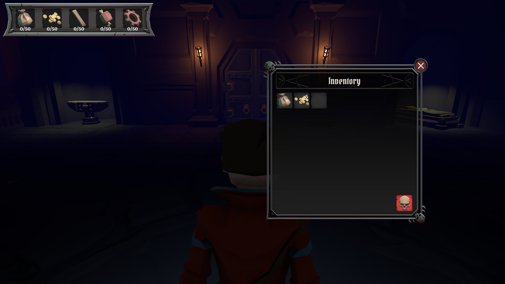

“Inventory Horror” is my submission to the “GMTK Game Jam 2025”, the first game jam I ever participated in. Within less than four days, I completed this game as a solo developer without the help of AI. 

In “Inventory Horror,” you explore a dungeon to collect different resources, buy upgrades, and finally escape the place. In the first place, it is an inventory-management and automation game. However, through purposely missing quality-of-life features, the gameplay becomes terrifying over time, which, combined with the spooky environments and sounds, makes the game fit its title. Further, the heavily looping gameplay matches the game jam’s theme: loop. The game was received well and described as fun to play by game jam reviewers, who mainly criticized the missing tutorial.

With the development of this game, I learned how to conceptualize and implement a game fitting to a given topic in a very limited time, cutting/limiting features to meet the deadline.

You may download “Inventory Horror” from [itch.io](https://mauri2070.itch.io/inventory-horror).

Used technology: Unity, C#

### Candy Hunt

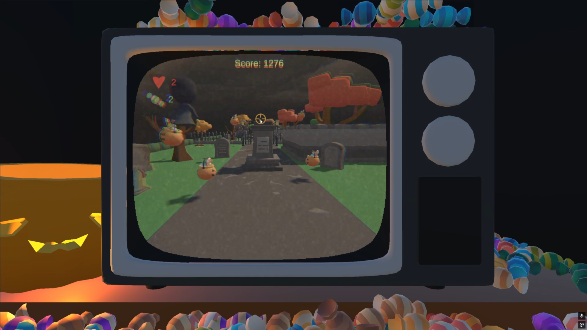

“Candy Hunt” is my submission to the “GameDevTV October/Halloween Jam 2025”. While the Jam was 10 days long, I had to complete my submission as a solo developer in only 2-3 days due to other responsibilities. Further, only provided or free assets could be used in this jam.

Following the visual inspiration of the game jam – the picture of an old tube TV – the gameplay of “Candy Hunt takes place on that TV. The player controls the death, dodging obstacles, skeletons, and giant bats, while collecting candy and using it to beat the enemies. From the two optional themes of the game jam, I selected “A helpful feature that turns against you”. Therefore, attacking enemies requires candy as ammunition. However, every time the player collects candy on the TV, the room fills with even more candy, slowly filling up the room and blocking the view of the gameplay, eventually making it impossible to continue and leading to a game over.

For this game jam, I learned to develop with Unity for WebGL.

You may play “Candy Hunt” on [itch.io](https://mauri2070.itch.io/candy-hunt) or watch a [gameplay video](https://youtu.be/K60D5nanc84).

Used technology: Unity, C#, Inkscape

### Unity Timeless Tetris

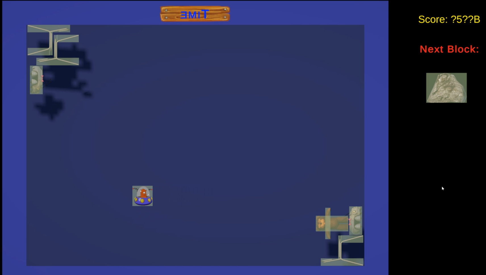

"Unity Timeless Tetris" is my submission to the "Unity 20th Anniversary Game Jam" (2025). Within about 6-7 hours, I completed this horizontal version of Tetris, which allows the player to change the direction of time and relocate blocks in the opposite direction. All assets used were provided by Unity for the game jam. 

You may play "Unity Timeless Tetris" on [itch.io](https://mauri2070.itch.io/utt), where you can also read how the game fits the "Timeless" topic of the jam. Further, you can watch a [gameplay video on YouTube](https://youtu.be/lzzmTT2IhRE).

Used technologies: Unity, C#

### We didn't (m)ask much of you!!!

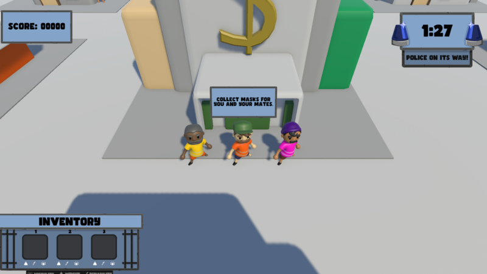

"We didn't (m)ask much of you!!!" is the game I worked on for the "Global Game Jam 2026". Starting Friday evening with brainstorming and teambuilding in the "Gamerei" in Munich, the jam lasted until Sunday afternoon. While I was responsible for programming and in-engine setup, my teammates [Simon Waldschütz](https://www.artstation.com/simon_waldschuetz) and [Tim Sommer](https://www.linkedin.com/in/tim-sommer-ft/) created the assets for the game. 

You may download the game from the [GGJ Website](https://globalgamejam.org/games/2026/we-don-1) in its original version or play it on [itch.io](https://mauri2070.itch.io/we-didnt-mask-much-of-you) with minor bugfixes and QoL improvements.

Used technologies: Unity, C#